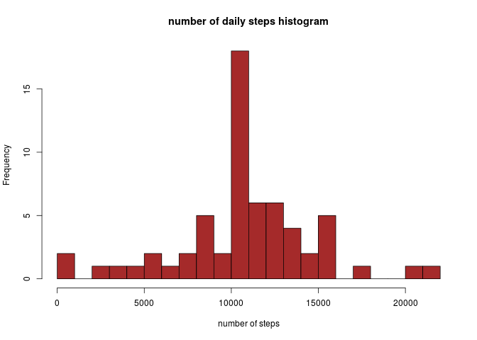

It is now possible to collect a large amount of data about personal movement using activity monitoring devices such as a Fitbit, Nike Fuelband, or Jawbone Up.

This report makes use of data from a personal activity monitoring device. This device collects data at 5 minute intervals throughout the day. The data consists of two months of data from an anonymous individual collected during the months of October and November, 2012 and include the number of steps taken in 5 minute intervals each day

The report tries to analyse and answer a few questions about the already mentioned data


We start by loading the great package dplyr which  very efficiently operates on R dataframes and allows us to summarise data using very simple commands and the lattice graphics package

```{r}
library(dplyr, warn.conflicts=FALSE)
library(lattice)
```

## Loading and preprocessing the data
we read the activity.csv file (placed in the current working directory, downloaded from https://d396qusza40orc.cloudfront.net/repdata%2Fdata%2Factivity.zip ) into the activity_df variable and insure that column date is of Date class

```{r}
activity_df <- read.csv("./activity.csv")
activity_df$date =as.Date(activity_df$date)
```

## What is mean total number of steps taken per day?
Next , in order to obtain the daily total number of steps ( removing NAs) we use the convenient dplyr functions filter , group_by and summarise ( also using a new variable yActivity in order to mantain the original dataframe unalterd  ) . We finalize by converting the result to a dataframe

```{r}
yActivity  <- filter( activity_df , ! is.na(activity_df$steps))
yActivity <- group_by(yActivity , date)
yActivity  <- summarise(yActivity , sum_steps = sum(steps))
yActivity <- as.data.frame(yActivity)
print(head(yActivity,5))
```

we plot the histogram
```{r}
png(file="./figure/histogram1.png" , width = 672, height = 480)
hist(yActivity$sum_steps, xlab="number of steps", main="number of daily steps histogram" , breaks=20, col="wheat")
dev.off()
```


and calculate the mean and the median
```{r}
meanSteps <- mean(yActivity$sum_steps)
medianSteps <- median(yActivity$sum_steps)
sprintf("mean steps per day is : %.2f " , meanSteps)
sprintf("median total steps per day is: %.2f " , medianSteps)
```

```{r, echo = FALSE}
format_military_time <- function(v_string) {
      out = character()
      for ( el in v_string) {
          new_str = paste(substr(el,1,2), ":",  substr(el,3,4), sep="")
          out=c(out, new_str)
      }  
      out
}
```

## What is the average daily activity pattern?
```{r}
intervalActivity <- filter( activity_df , ! is.na(activity_df$steps))
intervalActivity <- group_by(intervalActivity , interval)
intervalActivity  <- summarise(intervalActivity , mean_steps = mean(steps))
intervalActivity <- as.data.frame(intervalActivity)
png(file="./figure/timeseries1.png" , width = 672, height = 480)
plot( intervalActivity$interval , intervalActivity$mean_step,type="l",  xaxt = "n" ,xlab="time", ylab="number of steps" , main="Mean number of steps per interval along the day" )
axis(1,at=seq(0,2100,300), labels=format_military_time(sprintf("%04d", seq(0,2100,300))))
dev.off()
```


####interval with the biggest number of steps
in order to determine the interval with the highest number of steps we sort the intervalActivity dataframe by the mean_steps column in descending order and pick the top row value 
```{r}
intervalActivity <- arrange(intervalActivity , desc(mean_steps) )
print(head(intervalActivity,3))
interval_start <- format_military_time(c(sprintf("%04d",intervalActivity$interval[1] )))[1]
interval_end <- format_military_time(c(sprintf("%04d",intervalActivity$interval[1]+5 )))[1]
sprintf("The 5 minute interval of the day (on average across all the days in the dataset) that contains the maximum number of steps is the one starting at %s and ending at %s with a mean of %.2f steps", interval_start, interval_end ,intervalActivity$mean_steps[1])
```

## Imputing missing values
There were several NA values in the dataframe steps column. We decided that for each interval we would replace an NA value with the mean number of steps across all days for that interval
```{r}
activity_conv_NA <- activity_df
activity_conv_NA <- mutate(activity_conv_NA , steps_na = is.na(activity_conv_NA$steps))
for ( el in unique(activity_conv_NA$interval) ) {
    activity_conv_NA[is.na(activity_conv_NA$steps) &  activity_conv_NA$interval== el,  "steps"] =                             intervalActivity[intervalActivity$interval == el, "mean_steps" ]
}
#print(head(activity_conv_NA,5))
```

and let's again summarise the info per day and plot the new histogram

```{r}
summary_activity_conv_NA <- group_by(activity_conv_NA , date)
summary_activity_conv_NA  <- summarise(summary_activity_conv_NA , sum_steps = sum(steps), nr_of_nas=sum(steps_na))
summary_activity_conv_NA <- as.data.frame(summary_activity_conv_NA)
#print(summary_activity_conv_NA)
png(file="./figure/histogram2.png" , width = 672, height = 480)
hist(summary_activity_conv_NA$sum_steps, xlab="number of steps", main="number of daily steps histogram" , breaks=20, col="brown")
dev.off()
```


the histogram looks fairly similar to the previous one
let's check on which days there were NA values 
```{r}
print(summary_activity_conv_NA[summary_activity_conv_NA$nr_of_nas > 0, ])
```

given that for each day there were 288 intervals we can conclude (by looking at the number of nas column) that NAs were only present on a small number of days , the ones with no observed values at all. Either a day had values for all intervals or had no values for all intervals

Only one bar on the histogram is altered ( it becomes higher) , the one corresponding to the mean number of steps per day (which is not surprising given that the values we filled for days with NAs were based on the mean number of steps), all the others are equal.

let's calculate the mean and the median number of steps per day
```{r}
meanSteps <- mean(summary_activity_conv_NA$sum_steps)
medianSteps <- median(summary_activity_conv_NA$sum_steps)
sprintf("mean total steps per day is : %.2f " , meanSteps)
sprintf("median total steps per day is: %.2f " , medianSteps)
```
We conclude that the mean number of steps per day was not altered ( which again is not surprising given the strategy we decided to use to fill NAs -> we filled with values based on the mean steps , and we know that by adding values to a sample equal to the mean , the mean will not be altered )
and the median is now slightly higher. 

## Are there differences in activity patterns between weekdays and weekends?

let's go back to our activity_conv_NA dataframe and buid a new dataframe where we add a new column day_type which will hold a factor variable with two levels : "weekday" and "weekend" . We start by filling every cell in the column with "weekday" and then alter the weekend days to "weekend".
Then we group by interval and summarise calculating the average number of steps per interval across all days
```{r}
weekActivity_conv_NA <- mutate(activity_conv_NA , day_type="weekday"  )
weekActivity_conv_NA[weekdays(weekActivity_conv_NA$date) %in% c("Saturday", "Sunday"), "day_type"]=                                                                   "weekend" 
weekActivity_conv_NA$day_type=factor(weekActivity_conv_NA$day_type)
weekActivity_conv_NA <- group_by(weekActivity_conv_NA , interval, day_type)
weekActivity_conv_NA <- summarise(weekActivity_conv_NA , mean_steps = mean(steps),                                                          nr_of_nas=sum(steps_na))
weekActivity_conv_NA <- as.data.frame(weekActivity_conv_NA) 
#print(weekActivity_conv_NA)
```


```{r}
summary_weekActivity_conv_NA <- group_by(weekActivity_conv_NA, day_type)
summary_weekActivity_conv_NA <- summarise(summary_weekActivity_conv_NA , mean_steps =                                                      mean(mean_steps))
summary_weekActivity_conv_NA <- as.data.frame(summary_weekActivity_conv_NA )
print(summary_weekActivity_conv_NA)
```

let's make a panel plot comparing the steps per interval on weekdays and weekends
```{r}
png(file="./figure/panelplot.png" , width = 672, height = 480)
xyplot(weekActivity_conv_NA$mean_steps ~ weekActivity_conv_NA$interval | weekActivity_conv_NA$day_type, type = "l", layout = c(1, 2), xlab = "Interval", ylab = "Number of steps" , main="average number of steps per interval along the day (weekday vs weekend)")
dev.off()
```


